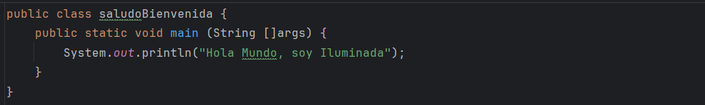

🎓 Estudiante de Desarrollo de Aplicaciones Web (DAW) y actualmente en formación.

## 👩‍💻 Sobre mí
Ahora mismo estoy aprendiendo desarrollo web haciendo ejercicios y probando cosas nuevas. Me gusta entender lo que estoy programando y mejorar poco a poco, tanto el código como mi forma de trabajar.

## 🛠 Tecnologías que uso

