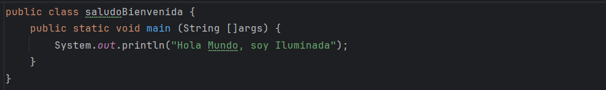

  
   
  <em>🎓 Estudiante de Desarrollo de Aplicaciones Web (DAW) y actualmente en formación.</em>

## 👩‍💻 Sobre mí
Profesional, con ganas de aprender y comprometida. Ahora mismo estoy haciendo desarrollo web a base de programar y probando cosas nuevas. Me gusta entender lo que programo y mejorar poco a poco, tanto codificando como en mi forma de trabajar. 

## Competencias profesionales
- Toma de decisiones: Analizo diferentes opciones antes de elegir la solución más adecuada, priorizando claridad y eficiencia.
- Trabajo en equipo: Me adapto fácilmente, aportando ideas y escuchando activamente al equipo.
- Trabajo bajo presión: Mantengo la organización y la calma.
- Empatía y comunicación: Me esfuerzo por entender diferentes puntos de vista y comunicarme de forma clara y respetuosa.

## 🚀 Qué he aprendido

## Qué estoy aprendiendo

